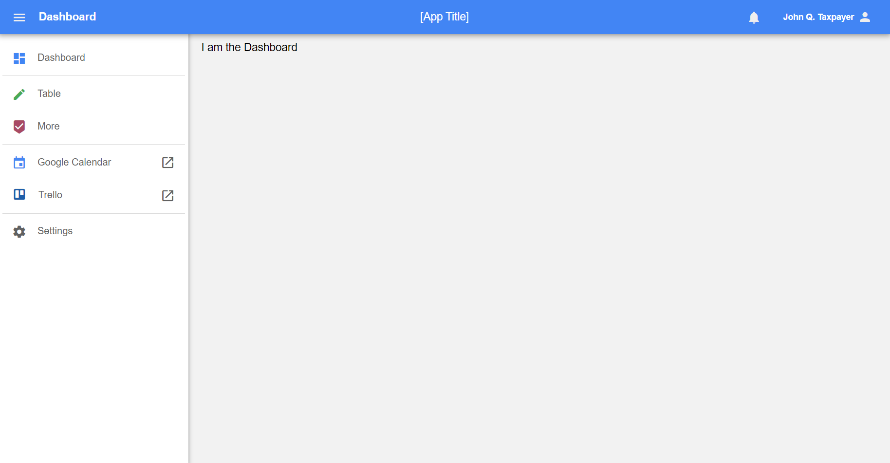
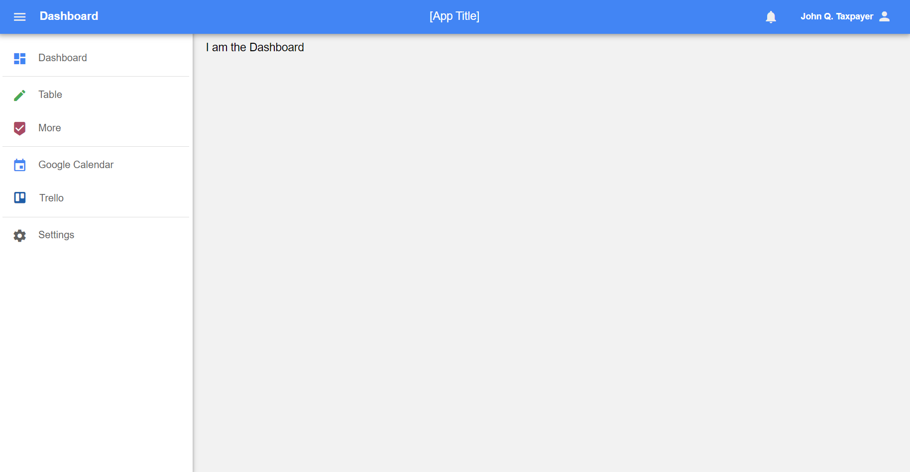
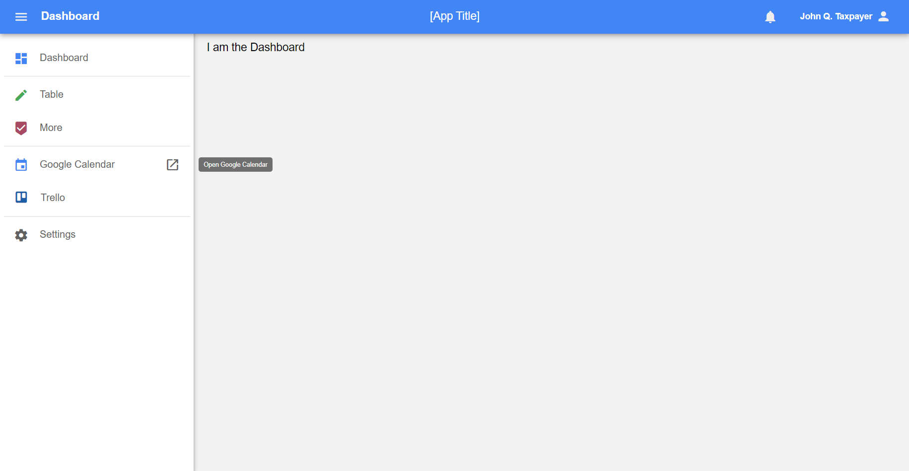
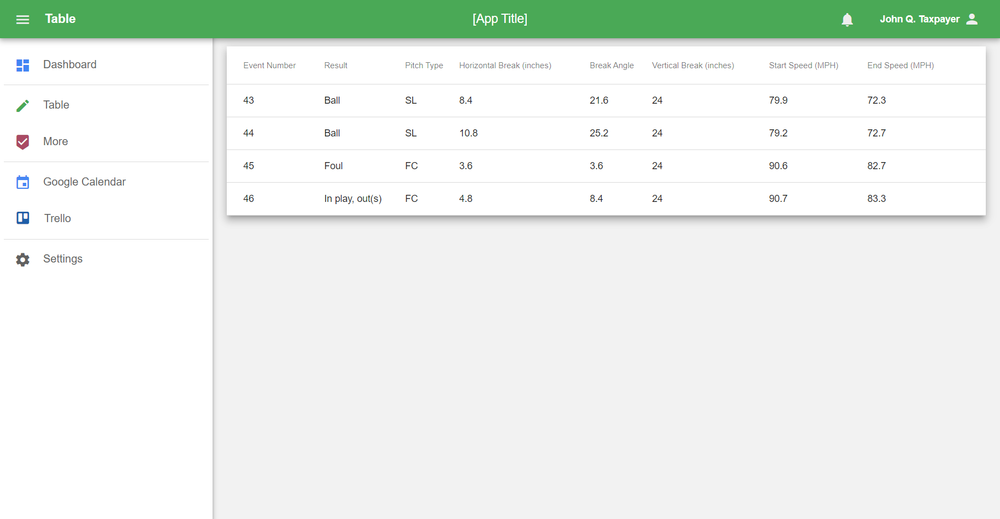
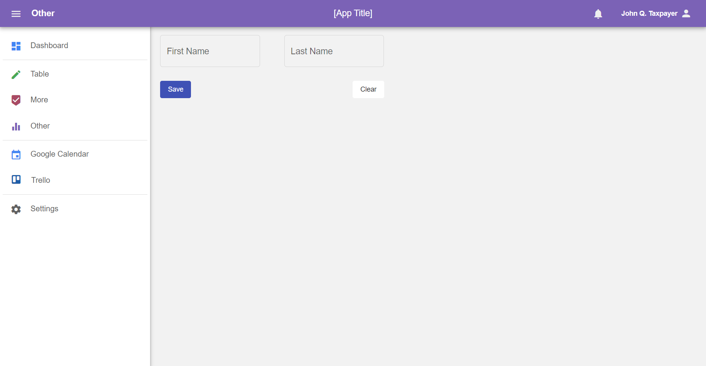

## About This Project

This is a sample Angular coding exercise. There are several "stories" below that should be completed to demonstrate experience with Angular 2+. A great first step would be to examine the code to get the lay of the land.

## Stories

Create a branch in Git and complete each one of these "stories" as its own commit on that branch. All screenshots are provided for clarity purposes. Your finished story does not need to look the same as the screenshot as long as it accomplishes the goal.

### 1. Make the external website icons only visible on hover

Currently, the links for Google Calendar and Trello on the sidebar have an icon that is always visible like so:

Hide the icons unless the user hovers over the button. Hovering anywhere on the button should make that icon appear. At the end of the story, it should look like the following screenshots:

### 2. Create a Material table using public JSON data

Create a new Angular component for the table page content. In this new component, add a [Material Angular Table](https://material.angular.io/components/table/overview). For the data, load [this publicly available JSON data](http://gd2.mlb.com/components/game/mlb/year_2017/month_05/day_09/gid_2017_05_09_nyamlb_cinmlb_1/game_events.json) using an HTTP GET. Traverse the JSON object to show in the table the data for any one of the many `pitch` arrays. Include the following data properties as columns in your table:

- `event_num`
- `des`
- `pitch_type`
- `break_length`
- `break_angle`
- `break_y`
- `start_speed`
- `end_speed`

Here is an example of a finished story:

### 3. Create a simple form on a new tab

Create a new tab just like the "Table" or "More" tabs. Call it whatever you like. In the content section of that new tab, create a simple form with two fields and two buttons. The fields should be labeled "First Name" and "Last Name." The buttons should be labeled "Save" and "Clear." When a user clicks the "Save" button, the browser should display a `console.log()` message in the browser's console. When a user clicks the "Clear" button, it should reset the values of both the fields.

An example of a finished form:

### 4. Any other optimizations you want to make

This project is purposefully not written in an ideal way. Feel free to fix these things!

Consider everything in this story "bonus points." This fourth story is simply an opportunity to demonstrate skills/knowledge we did not ask for specifically. Nothing is expected here. If you decide to call it quits after the first three stories, that is 100% fine.